# 第1章 计算机系统漫游

[toc]

计算机系统：硬件、系统软件

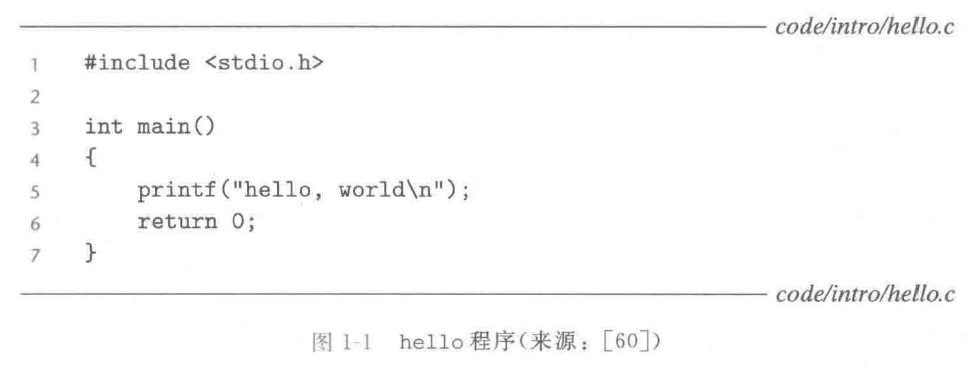

## 1.1 信息就是位+上下文

源程序 / 源文件：文本文件
文件名：hello.c
文本字符：ASCII标准
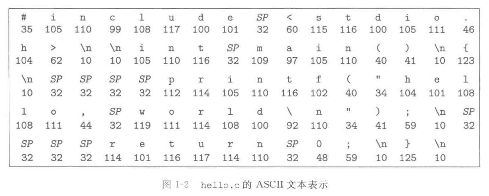
文本文件：只由ASCII字符构成
二进制文件

系统中所有的信息：都是由一串比特表示的
	磁盘文件
	内存：程序、用户数据
	网络：数据
区分不同数据对象的唯一方法：读到这些数据对象时的上下文

数字的机器表示方式：对真值的有限近似值

C编程语言的起源
	贝尔实验室，Dennis Ritchie，1969年~1973年
	ANSI C的标准：美国国家标准学会（American National Standards Institute，ANSI），1989年
	国际标准化组织（International Standards Organization，ISO）
	C标准库
	Kernighan和Ritchie的经典著作：K&R
	C语言成功的原因：
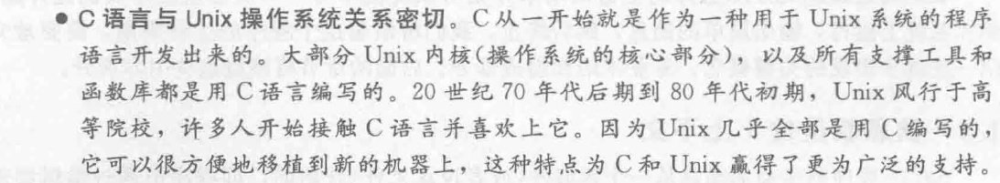
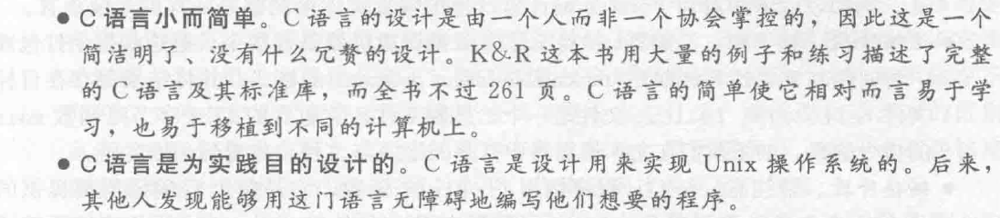
	C语言：系统及编程的首选，也适用于应用级程序的编写
	指针：造成程序员困惑、程序错误
	C语言：缺乏对抽象的显示支持，如类、对象、异常

## 1.2 程序被其他程序翻译成不同的格式

机器语言指令
可执行目标程序 / 可执行目标文件
二进制磁盘文件

编译器驱动程序：源文件 → 目标文件
gcc -o hello hello.c（GCC编译器驱动程序：源程序文件hello.c → 可执行目标文件hello）
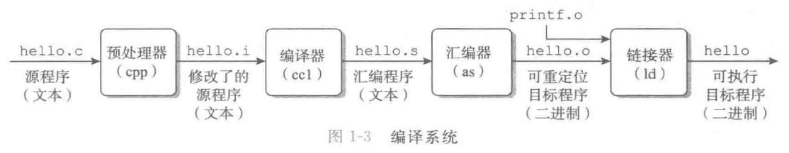
编译系统（compilation system)：预处理器、编译器、汇编器、链接器
翻译过程的四个阶段：
	预处理阶段：略
	编译阶段：略
	汇编阶段：略
	链接阶段：略

GNU项目：
	GNU（GNU's Not Unix）
	1984年
	Richard Stallman
	GNU环境：
		EMACS编辑器
		GCC编译器
		GDB调试器
		汇编器
		链接器
		处理二进制文件的工具
		······
	现代开放源码运动
	自由软件（free software）

## 1.3 了解编译系统如何工作是大有益处的

程序员必须知道编译系统是如何工作的原因：
	**优化程序性能：**
		了解：机器代码、编译器将不同的C语句转化为机器代码的方式
		一个switch语句是否总是比一系列的if-else语句高效得多？
		一个函数调用的开销有多大？
		while循环比for循环更有效吗？
		指针引用比数组索引更有效吗？
		为什么将循环求和的结果放到一个本地变量中，会比将其放到一个通过引用传递过来的参数中，运行起来快很多呢？
		为什么我们只是简单地重新排列一下算术表达式中的括号就能让函数运行得更快？
		第3章：
			x86：最近几代Linux、Macintosh、Windows计算机的机器语言
			编译器是怎样把不同的C语言结构翻译成x86的
		第5章：简单转换C语言代码 → 帮助编译器更好地完成工作 → 调整C程序的性能
		第6章：
			存储器系统的层次结构特性
			C语言编译器如何将数组存放在内存中
			C程序如何能够利用这些知识从而更高效地运行
	**理解链接时出现的错误：**
		第7章：
			链接器报告说它无法解析一个引用，这是什么意思？
			静态变量和全局变量的区别是什么？
			如果你在不同的C文件中定义了名字相同的两个全局变量会发生什么？
			静态库和动态库的区别是什么？
			我们在命令行上排列库的顺序有什么影响？
			为什么有些链接错误直到运行时才会出现？
	**避免安全漏洞：**
			缓冲区溢出错误：大多数网络和Internet服务器上安全漏洞的主要原因
			→ 需要限制从不受信任的源接收数据的数量和格式
			学习安全编程的第一步：理解数据和控制信息存储在程序栈上的方式会引起的后果
			第3章：
				堆栈原理
				缓冲区溢出错误

## 1.4 处理器读并解释储存在内存中的指令

在Unix系统上运行可执行文件：./hello
shell：命令解释器

### 1.4.1 系统的硬件组成

近期Intel系列产品族的模型：
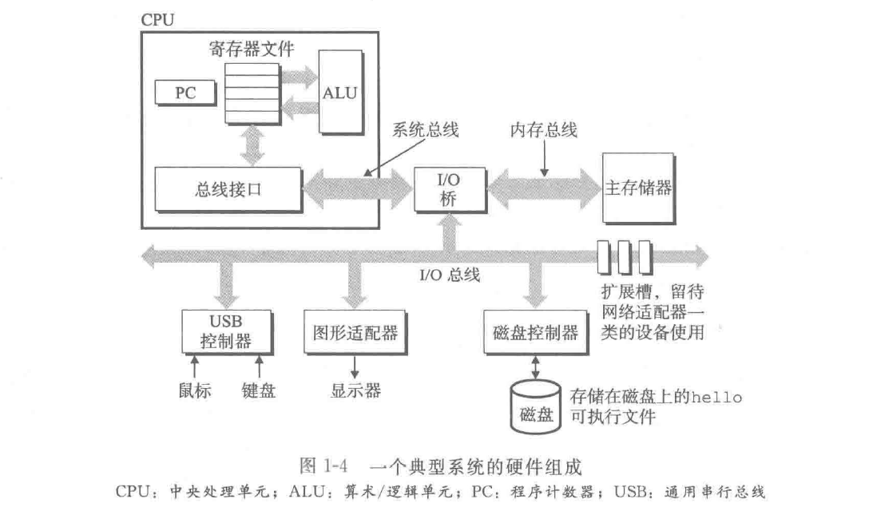

#### 1. 总线

总线：贯穿整个系统的一组电子管道
	携带信息字节、在各个部件间传递
	传送定长的字节块 / 字（word）

字长：字中的字节数（一个基本的系统参数）
	大多数机器字长：4个字节（32位）、8个字节（64位）

#### 2. I/O设备

I/O（输入/输出）设备：系统于外部世界的联系通道
用户输入：键盘、鼠标
用户输出：显示器
长期存储数据和程序：磁盘驱动器 / 磁盘

控制器、适配器：I/O设备 ↔ I/O总线
	控制器：芯片组（I/O设备本身、系统的主印制电路板 / 主板）
	适配器：插在主板插槽上的卡
	功能：在I/O总线和I/O设备之间传递信息

第6章：磁盘之类的I/O设备是如何工作的
第10章：如何在应用程序中利用Unix I/O接口访问设备

#### 3. 主存

主存：临时存储设备，存放程序和程序处理的数据
	物理上：由一组*动态随机存取存储器*（DRAM）芯片组成
	逻辑上：一个线性的字节数组（数组索引：地址）

在运行Linux的x86-64机器上：
	short类型：2个字节
	int类型：4个字节
	long类型：8个字节
	float类型：4个字节
	double类型：8个字节

第6章：存储器技术
	DRAM芯片是如何工作的，它们又是如何组合起来构成主存的

#### 4. 处理器

中央处理单元 / 处理器（CPU）：解释/执行存储在主存中指令的引擎
程序计数器（PC）：（在任何时刻）指向主存中的某条机器语言指令（含有该条指令的地址）
指令集架构
指令：顺序执行
寄存器文件（register file）
算术/逻辑单元（ALU）
CPU的操作：
	加载：主存 → 寄存器
	存储：寄存器 → 主存
	操作：算术运算（ALU）
	跳转：指令 → 程序计数器（PC）

指令集架构：每条机器代码指令的效果
微体系结构：处理器实际上是如何实现的

第3章：机器的指令集架构所提供的抽象性
第4章：处理器实际上是如何实现的
第5章：现代处理器是如何工作的、预测和优化机器语言程序的性能

### 1.4.2 运行hello程序

shell程序：键盘（字符串） → 寄存器 → 内存
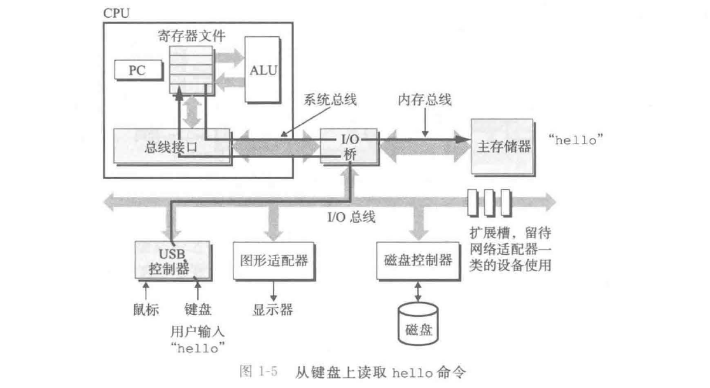

敲回车键后：（shell）加载可执行的hello文件（hello目标文件中的代码和数据：磁盘 → 主存）
直接存储器存取（DMA，第6章）技术：数据可以不通过处理器
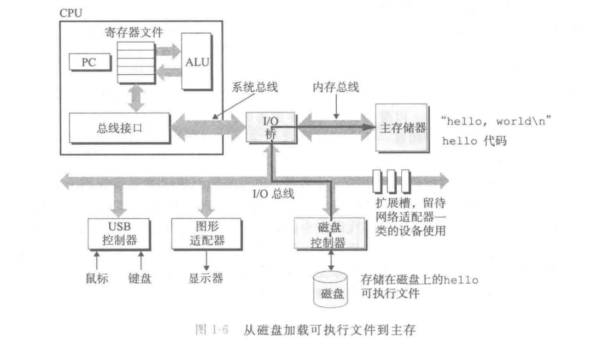

处理器：执行hello程序
“hello, world\n”字符串：主存 → 寄存器文件 → 显示设备
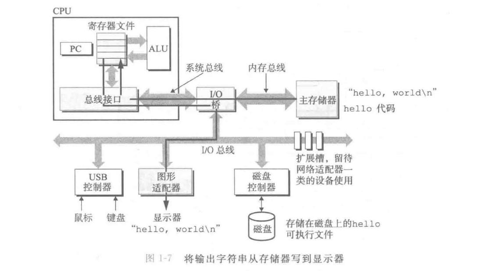

## 1.5 高速缓存至关重要

hello程序：磁盘 → 主存 → 处理器
复制 = 开销 → 减慢了程序“真正”的工作
系统设计者的一个主要目标：使这些复制操作尽可能快地完成

|                      | 主存 | 磁盘驱动器 |
| :------------------: | :--: | :--------: |
|         容量         | 1倍  |   1000倍   |
| 读取一个字的时间开销 | 1倍  |  1000万倍  |

|              | 寄存器文件 |    主存    |
| :----------: | :--------: | :--------: |
|  存储的信息  |  几百字节  | 几十亿字节 |
| 读数据的时间 |    1倍     |   100倍    |

处理器与主存之间的差距还在持续增大

高速缓存存储器 / cache / 高速缓存（cache memory）：暂时的集结区域，存放处理器近期可能会需要的信息
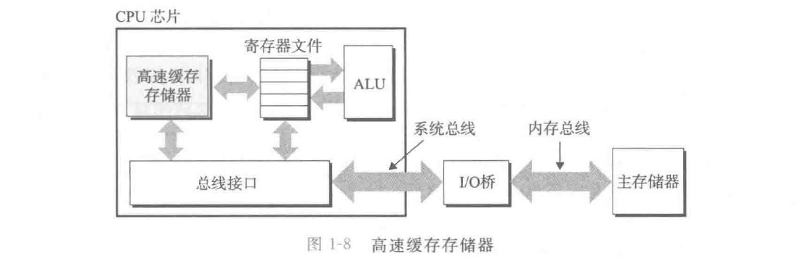

L1高速缓存：
	处理器芯片上
	容量：数万字节
	访问速度：几乎和访问寄存器文件一样快

L2高速缓存：
	容量：数十万~数百万字节
	访问时间：比访问L1高速缓存的时间长5倍、比访问主存的时间快5~10倍

实现L1和L2高速缓存的硬件技术：静态随机访问存储器（SRAM）

高速缓存的局部性原理：程序具有访问局部区域里的数据和代码的趋势

第6章：利用高速缓存将程序的性能提高一个数量级

## 1.6 存储设备形成层次结构

存储器层次结构：
	从上至下：设备的访问速度↓，容量↑，每字节的造价↓
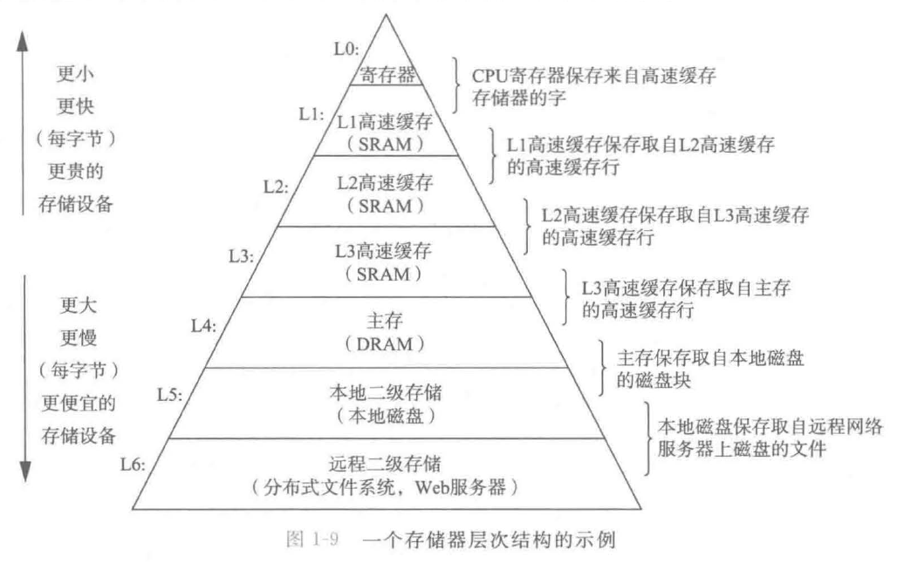

分布式文件系统的网络系统：
	本地磁盘：存储在其他系统中磁盘上的数据的高速缓存

第6章：利用对整个存储器层次结构的理解来提高程序性能

## 1.7 操作系统管理硬件

shell、hello程序：依靠操作系统提供的服务

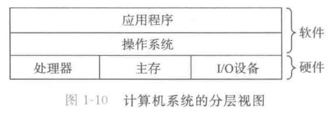
所有应用程序对硬件的操作尝试都必须通过操作系统

操作系统的两个基本功能：
	（1）防止硬件被失控的应用程序滥用
	（2）向应用程序提供简单一致的机制来控制复杂而又通常大不相同的低级硬件设备

操作系统几个基本的抽象概念：
	文件：对I/O设备的抽象表示
	虚拟内存：对主存和磁盘I/O设备的抽象表示
	进程：对处理器、主存和I/O设备的抽象表示
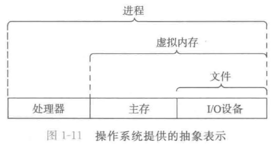

Unix、Posix和Unix规范：
	20世纪60年代的操作系统：大型、复杂
		IBM：OS/360
		Honeywell：Multics（思想：层次文件系统、shell、······）
	Unix：
		贝尔实验室：Ken Thompson、Dennis Ritchie、Doug Mcllroy、Joe Ossanna
		1969年：在DEC PDP-7计算机上完全用机器语言编写
		1970年：命名为”Unix“（Brain Kernighan）
		1973年：用C重新编写内核
		1974年：开始正式对外发布
	20世纪70年代晚期~80年代早期：
		Unix 4. xBSD（Berkeley Software Distribution）：美国加州大学伯克利分校，增加：虚拟内存、Internet协议
		System V Unix：贝尔实验室
		Solaris系统：Sun Microsystems
	20世纪80年代中期：
		IEEE（电气和电子工程师学会）：标准化Unix的开发
		命名为“Posix”（Richard Stallman） → Posix标准：
			Unix系统调用的C语言接口
			shell程序和工具
			线程及网络编程
	统一的Unix系统标准：标准Unix规范 + Posix

### 1.7.1 进程

程序在现代系统上运行时，操作系统提供的一种假象：
	系统上只有这个程序在运行
	程序看上去是独占地使用处理器、主存、I/O设备
	处理器在不间断地一条接一条地执行程序中的指令（该程序的代码和数据是系统内存中唯一的对象）
假象的实现：进程

进程：操作系统对一个正在运行的程序的一种抽象
	在一个系统上可以同时运行多个进程
	每个进程都好像在独占地使用硬件

并发运行：一个进程的指令和另一个进程的指令是交错执行的

传统系统：在一个时刻只能执行一个程序
多核处理器：同时能够执行多个程序

CPU：看上去像是在并发地执行多个进程
	实现：处理器在进程间切换

上下文：操作系统保持跟踪进程运行所需的所有状态信息（如：PC、寄存器文件的当前值、主存的内容）
操作系统：把控制权从当前进程转移到某个新进程 → 上下文切换：
	保存当前进程的上下文
	恢复新进程的上下文
	将控制权传递到新进程
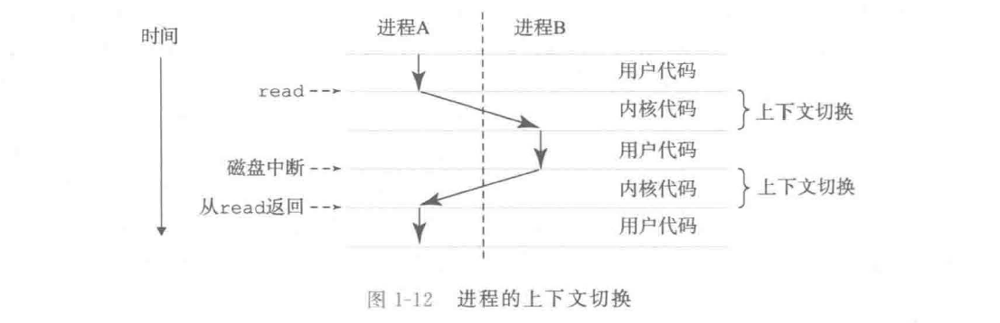

shell进程：
	等待命令行上的输入
	系统调用：将控制权传递给操作系统
↓
操作系统：
	保存shell进程的上下文
	创建一个新的hello进程及其上下文
	将控制权传给新的hello进程
↓
hello进程
↓
操作系统：
	恢复shell进程的上下文
	将控制权传回给shell进程
↓
shell进程：
	等待下一个命令行输入

操作系统内核（kernel）：
	管理一个进程到另一个进程的转换
	操作系统代码常驻内存的部分
	不是一个独立的进程，是系统管理全部进程所用代码和数据结构的集合

系统调用（system call）指令：
	当应用程序需要操作系统的某些操作（如读写文件）时执行
	将控制权传递给内核
	内核执行被请求的操作
	返回应用程序

第8章：
	实现进程这个抽象概念（低级硬件和操作系统软件之间的紧密合作）
	应用程序是如何创建和控制它们的进程的

### 1.7.2 线程

现代系统：一个进程由多个线程的执行单元组成
	每个线程：
		运行在进程的上下文中
		共享同样的代码和全局数据

网络服务器对并行处理的需求 → 线程：重要的编程模型
	多线程之间比多进程之间更容易共享数据
	线程一般比进程更高效

### 1.7.3 虚拟内存

虚拟内存：
	为每个进程提供了一个假象：每个进程都在独占地使用主存
虚拟地址空间：每个进程看到的内存都是一致的

Linux进程的虚拟地址空间：
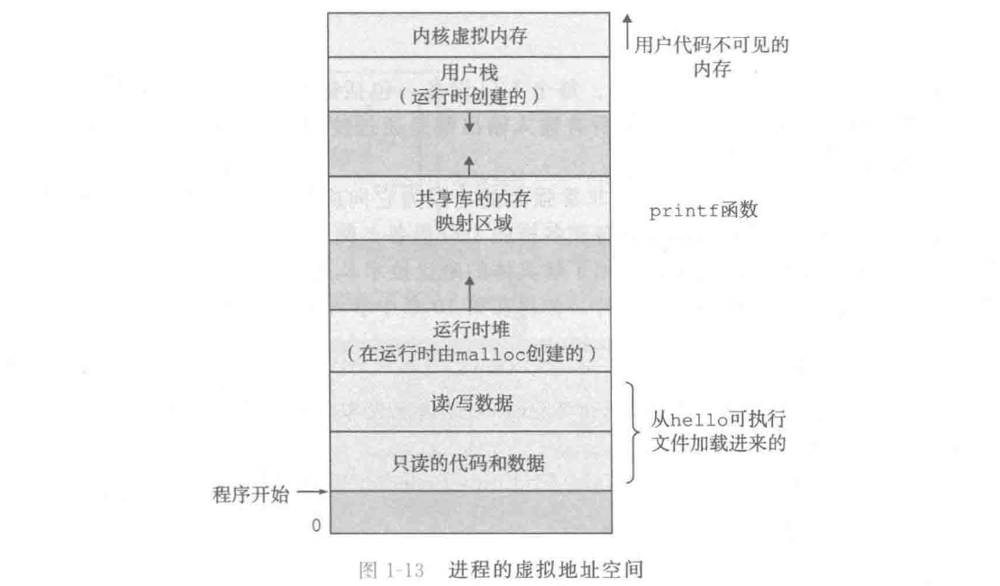
最上面的区域：操作系统的代码、数据
底部区域：用户进程定义的代码、数据

从最低的地址开始，逐步向上：

程序代码和数据 / 代码和数据区：代码、C全局变量
	直接按照可执行目标文件的内容初始化
	在进程一开始运行时就被指定了大小
	第7章：链接、加载、地址空间

堆：
	在运行时动态地扩展、收缩（C标准库函数：malloc、free）
	第9章：管理虚拟内存

共享库：共享库的代码、数据（C标准库、数学库）
	第7章：动态链接

栈 / 用户栈：实现函数调用
	在程序执行期间可以动态地扩展、收缩
	调用一个函数：栈增长
	从一个函数返回：栈收缩
	第3章：编译器时如何使用栈的

内核虚拟内存：
	不允许应用程序读写、直接调用内核代码定义的函数

虚拟内存的运作：硬件和操作系统软件之间精密复杂的交互
	处理器生成的每个地址的硬件翻译

第9章：把一个进程虚拟内存的内容存储在磁盘上，然后用主存作为磁盘的高速缓存

### 1.7.4 文件

文件：字节序列
每个I/O设备都可以看成是文件：磁盘、键盘、显示器、网络
系统中的所有输入输出：使用Unix I/O的系统函数调用读写文件
文件：它向应用程序提供了一个统一的视图，来看待系统中可能含有的所有各式各样的I/O设备
第10章：Unix I/O

Linux项目：
	1991年8月，Liuns Torvalds（芬兰）：Minix（类Unix的操作系统内核）
	Linux项目 + GNU项目：完整的、符合Posix标准的Unix操作系统的版本（内核、基础设施）

## 1.8 系统之间利用网络通信

网络可视为一个I/O设备
数据：主存 → 网络适配器 → 网络 → 另一台机器
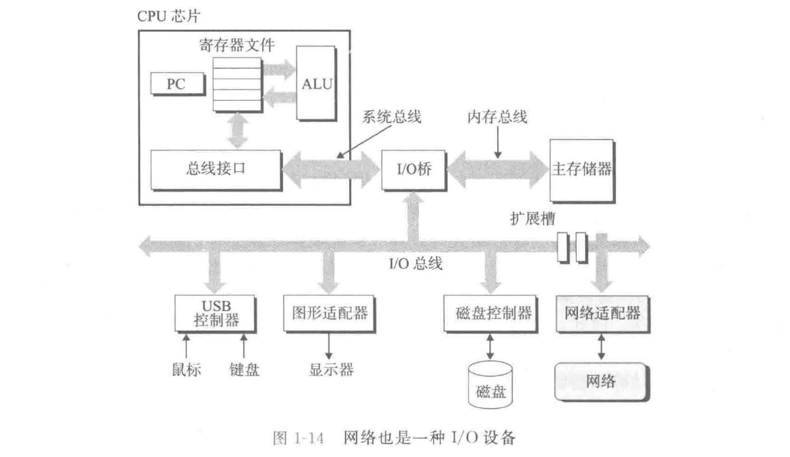

基于网络复制信息功能的应用：电子邮件、即时通信、万维网、FTP、telnet

本地主机：telnet客户端
远程主机：telnet服务器

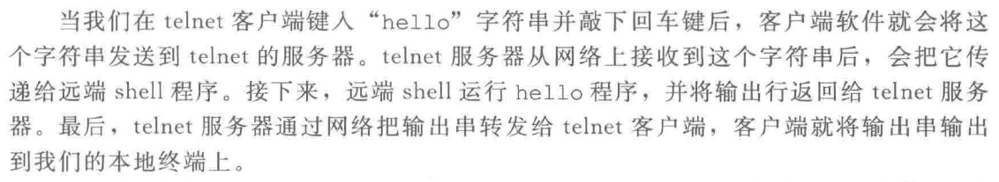

## 1.9 重要主题

系统：硬件和系统软件互相交织的集合体

### 1.9.1 Amdahl定律

Gene Amdahl：计算俚语的早期先锋之一

Amdahl定律（Amdahl's law）：当我们对系统的某个部分加速时，其对系统整体性能的影响取决于该部分的重要性和加速程度

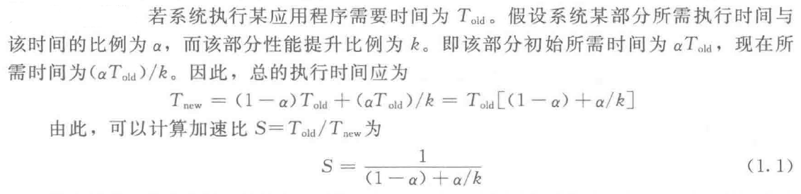

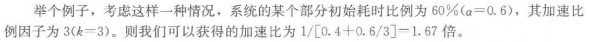
获得的系统加速比明显小于这部分的加速比

Amdahl定律：要想显著加速整个系统，必须提升全系统中相当大的部分的速度

表示相对性能：
	性能提升最好的表示方法：Told/Tnew（比例的形式）
		Told：原始系统所需时间
		Tnew：修改后的系统所需时间
		有所改进：比值>1
		用后缀“$\times$”来表示比例：“2.2$\times$”读作“2.2倍”
	表示相对变化更传统的方法：百分比
		变化小的情况
		定义模糊：100$\cdot$(Told-Tnew)/Tnew、100$\cdot$(Told-Tnew)/Told
		对较大的变化没有太大意义

Amdahl定律：k趋向于∞
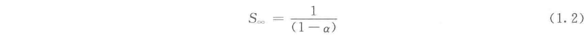

Amdahl定律：改善任何过程的一般原则
把性能提升2倍或更高的比例因子：只有通过优化系统的大部分组件才能获得

### 1.9.2 并发和并行

两个需求：驱动进步的持续动力
	想要计算机做得更多
	想要计算机运行得更快

并发（concurrency）：一个同时具有多个活动的系统
并行（parallelism）：用并发来使一个系统运行得更快
在计算机系统的多个抽象层次上运用：
	线程级并发
	指令级并行
	单指令、多数据并行

#### 1. 线程级并发

进程：设计出同时有多个程序执行的系统 → 并发
线程：在一个进程中执行多个控制流
单处理器系统：处理器必须在多个任务间切换、大多数实际的计算由一个处理器来完成
多处理器系统：由单个操作系统内核控制的多处理器组成的系统（从20世纪80年代开始）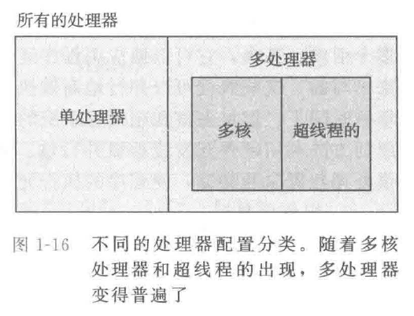

多核处理器：将多个CPU（核)集成到一个集成电路芯片上
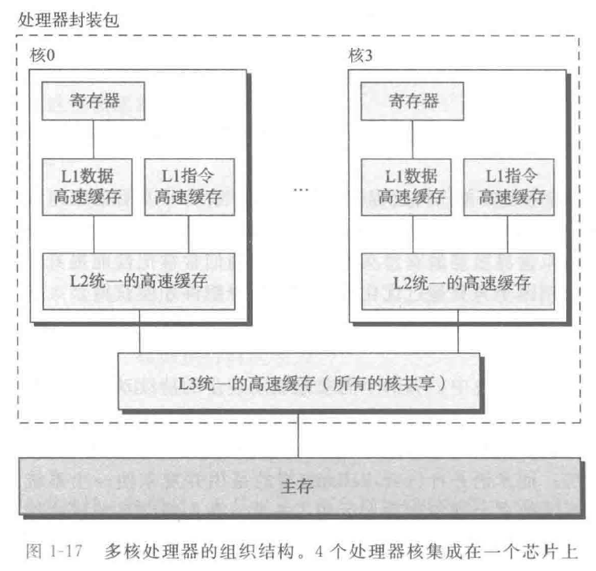
工业界的专家预言：能够将几十个、最终会是上百个核做到一个芯片上

超线程 / 同时多线程（simultaneous multi-threading）：允许一个CPU执行多个控制流
	CPU：
		有多个备份的硬件：如程序计数器、寄存器文件	
		只有一份的硬件：如执行浮点算术运算的单元
	常规的处理器：做不同线程间的切换（大约20 000个时钟周期）
	超线程的处理器：在单个周期的基础上决定要执行哪一个线程
	Intel Core i7：每个核执行两个线程 → 一个4核的系统可以并行地执行8个线程

多处理器地使用：提高系统性能
	减少了在执行多个任务时模拟并发地需要
	使应用程序运行得更快（程序是以多线程方式来书写的）

第12章：
	并发：提供处理器资源的共享、使程序的执行允许有更多的并行

#### 2. 指令级并行

指令级并行：现代处理器可以同时执行多条指令

早期的微处理器：
	Intel 8086（1978年）：多个（3~10个）时钟周期/指令
最近的处理器：
	2~4条指令/时钟周期
	每条指令：≥20个周期
	处理器：同时处理多达100条指令
第4章：流水线（pipelining）

超标量（superscalar）处理器
大多数现代处理器：超标量操作

第5章：
	超标量处理器的高级模型
	理解程序的性能
	写出拥有更高程度的指令级并行性的程序代码（运行得更快）

#### 3. 单指令、多数据并行

单指令、多数据 / SIMD并行：一条指令产生多个可以并行执行的操作
	如较新几代的Intel和AMD处理器：并行地对8对单精度浮点数（C数据类型float）做加法的指令
	提高执行速度：处理影像、声音、视频数据应用
	编译器：从C程序中自动抽取SIMD并行性
	用编译器支持的特殊的向量数据类型来写程序：如GCC

### 1.9.3 计算机系统中抽象的重要性

抽象：计算机科学中最为重要的概念之一
	如：
		为一组函数规定一个简单的应用程序接口（API）
		不同的编程语言提供不同形式和等级的抽象支持（如Java：类的声明；C语言：函数原型）

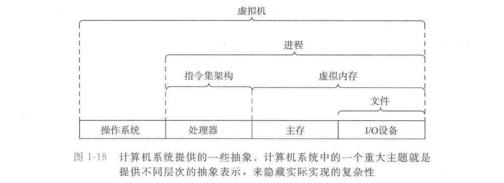
指令集架构：对实际处理器硬件的抽象
文件：对I/O设备的抽象
虚拟内存：对程序存储器的抽象
进程：对一个正在运行的程序的抽象
虚拟机：对整个计算机的抽象（操作系统+处理器+程序)

## 1.10 小结

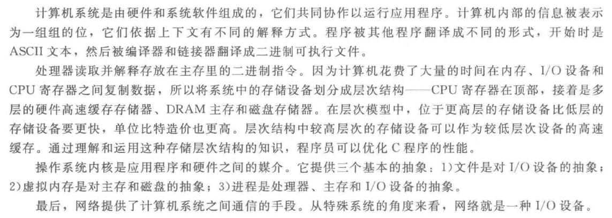
