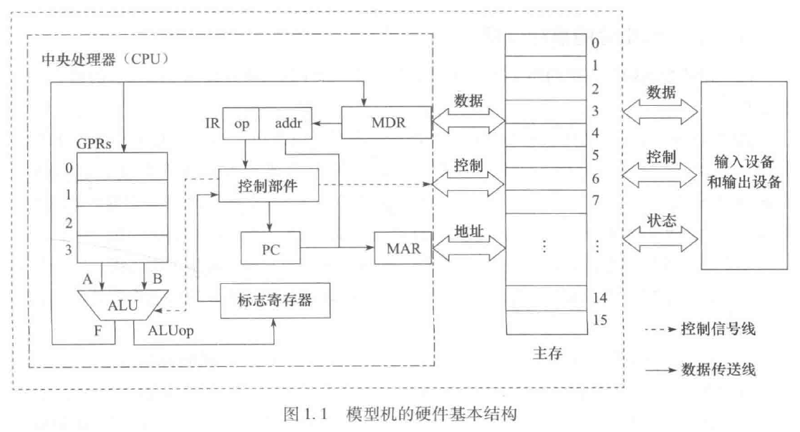
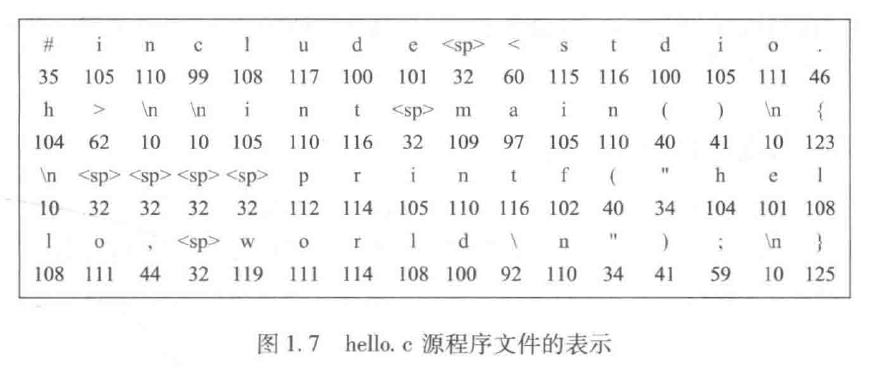
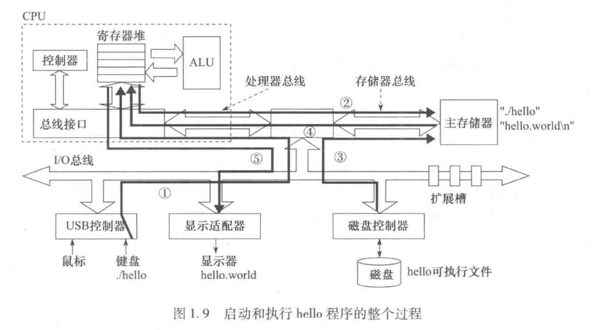
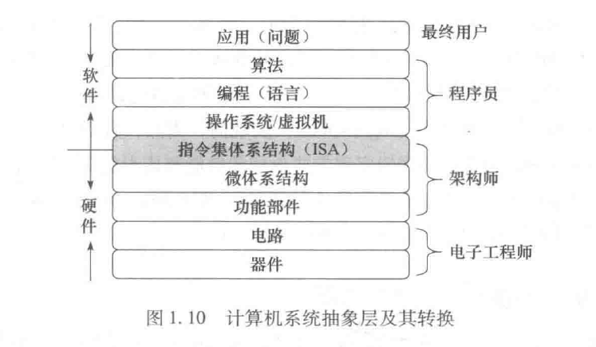
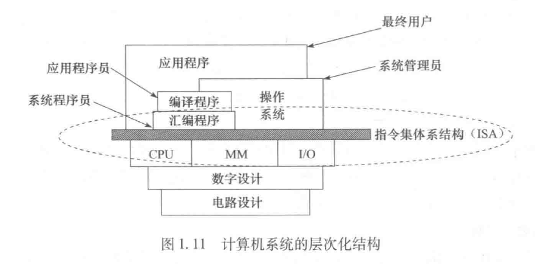
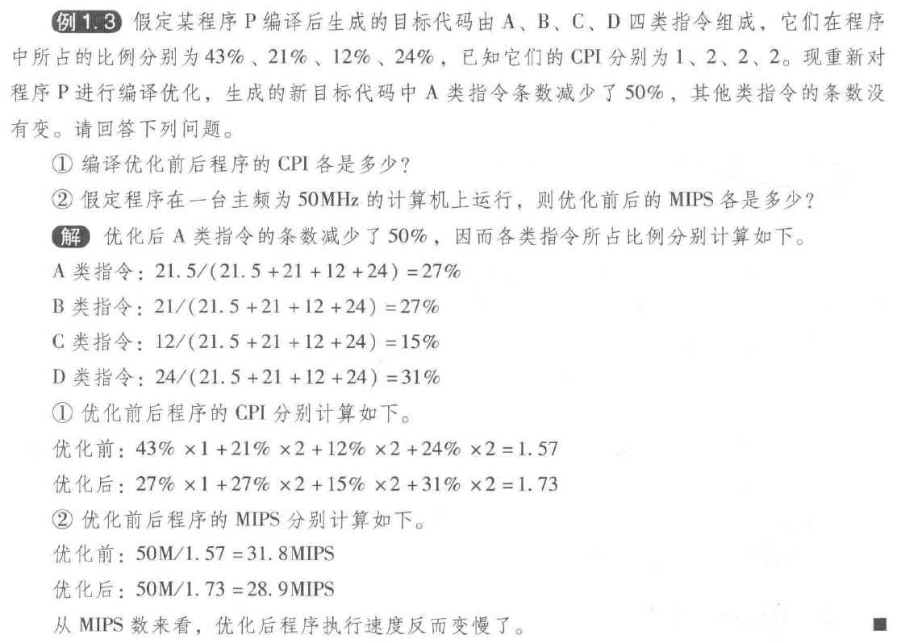

# 第1章 计算机系统概述


[toc]


本章概要介绍：
	计算机的基本工作原理
	冯·诺伊曼结构基本思想、冯·诺依曼结构计算机的基本构成
	程序和指令的执行过程
	计算机系统的基本功能和基本组成
	程序的开发与运行
	计算机系统层次结构
	计算机性能评价的基本概念


## 1.1 计算机基本工作原理

### 1.1.1 冯·诺依曼结构基本思想

ABC（Atanasoff-Berry Computer）：世界上第一台真正意义上的电子数字计算机
	1935~1939年
	美国艾奥瓦州大学
	约翰·文森特·阿塔纳索夫（John Vincent Atanasoff）：物理系副教授
	克利福特·贝瑞（Clifford Berry）：物理学研究生
	300个电子管
	只是个样机

ENIAC（Electronic Numerical Integrator and computer）：真正实用的电子数字计算机
	1946年2月
	莫克利（John W. Mauchly）
	艾克特（J. Presper Eckert）
	解决美军复杂的弹道计算问题
	用十进制表示信息
	设置开关和插拔电缆手动编程
	5000次加法运算/秒、50次乘法运算/秒

ABC与ENIAC的“世界第一台电子计算机”之争

约翰·文森特·阿塔纳索夫（1903-1995）：第一台电子计算机的真正发明人、电子计算机之父

EDVAC（Electronic Discrete Variable Automatic Computer）
	1945年
	冯·诺依曼：关于EDVAC的报告草案
	现代计算机结构思想的诞生

**存储程序**


**冯·诺依曼结构**的基本思想：


### 1.1.2 冯·诺依曼机基本结构



模型机：
① 主存储器 / 主存 / 内存：存放指令和数据
② 算术逻辑部件（Arithmetic Logic Unit，ALU）：算术逻辑运算
③ 控制部件 / 控制器（Control Unit，CU）：自动逐条取出指令并进行译码
④ 输入设备和输出设备：和用户交互

通用寄存器（General Purpose Register）、通用寄存器组（GPRs）
标志寄存器
指令寄存器（Instruction Register，IR）
程序计数器（Program Counter，PC）
中央处理器 / 处理器（Central Processing Unit，CPU）

主存单元地址 / 主存地址
存储部件：通用寄存器、主存

总线
地址线：地址信息
数据线：数据信息
控制线：控制信息
主存地址寄存器（Memory Address Register，MAR）
主存数据寄存器（Memory Data Register，MDR）


### 1.1.3 程序和指令的执行过程

指令（instruction）
取数指令（load）
存数指令（store）
加法指令（add）
传送指令（mov）

指令的字段：操作码字段、地址码字段
操作码字段：指令的操作类型（取数、存数、加、减、传送、跳转······）
地址码字段：指令所处理的操作数的地址（寄存器编号、主存单元编号······）


指令执行各阶段：若干个**微操作**
微操作：相应的**控制信号**（control signal）进行控制


时钟信号（clock signal）
时钟周期（clock cycle）
一条指令的执行时间：一个/多个时钟周期


## 1.2 程序的开发与运行

应用问题（任务） → 算法（algorithm）描述 → 用编程语言描述的程序

程序设计语言（programming language）
	严格的执行顺序
	不存在二义性


### 1.2.1 程序设计语言和翻译程序

程序设计语言：高级语言、低级语言

机器语言：0/1序列
机器代码 / 机器语言程序
机器指令：由0和1组成

汇编语言（assembly language）
汇编指令：机器指令对应的符号
汇编语言程序 → 机器语言程序 → 被计算机执行

低级语言 / 机器级语言：汇编语言、机器语言

高级程序设计语言 / 高级编程语言（high level programming language）：BASIC、C/C++、Fortran、Java······

翻译程序（translator）：高级编程语言 → 机器语言程序

源语言、源程序 → 目标语言、目标程序

翻译程序：
① 汇编程序 / 汇编器（assembler）：汇编语言源程序 → 机器语言目标程序
② 解释程序 / 解释器（interpreter）：源程序中的语句 → 机器指令（立即执行）
③ 编译程序 / 编译器（compiler）：高级语言源程序 → 汇编语言/机器语言目标程序


MIPS架构 / MIPS指令集系统结构
	20世纪80年代初
	斯坦福大学
	Hennessy教授
	RISC处理器
	MIPS（microcomputer without interlocked pipeline stages）
	MIPS R系列微处理器：高性能工作站、服务器、超级计算机系统
	MIPS K系列微处理器：游戏机、路由器、激光打印机、掌上电脑······


### 1.2.2 从源程序到可执行文件

hello.c的C语言源程序代码：


① hello.c文件
	在计算机中一ASCII字符方式存放
	文本文件（text file）
	源程序文件都是文本文件：可显示、可读


② hello.c → （预处理、编译、汇编、链接） → 可执行目标文件
	在UNIX系统中用GCC编译驱动程序进行处理：gcc -o hello hello.c


|    阶段    |                             程序                             |                           生成文件                           |
| :--------: | :----------------------------------------------------------: | :----------------------------------------------------------: |
| 预处理阶段 |    预处理程序（cpp）<br />处理：源程序中以字符#开头的命令    |                  源程序文件<br />扩展名：.i                  |
|  编译阶段  |         编译程序（ccl）<br />编译：预处理后的源程序          |              汇编语言源程序文件<br />扩展名：.s              |
|  汇编阶段  |           汇编程序（as）<br />汇编：汇编语言源程序           | 可重定位目标文件<br />扩展名：.o<br />一种二进制文件：不可读 |
|  链接阶段  | 链接程序（ld）<br />合并：多个可重定位目标文件、标准函数库中的可重定位目标文件 |                 可执行目标文件 / 可执行文件                  |

|    阶段    |                      程序                       |            生成文件             |
| :--------: | :---------------------------------------------: | :-----------------------------: |
| 预处理阶段 | 预处理程序（cpp）<br />处理：#include <stdio.h> |     源程序文件<br />hello.i     |
|  编译阶段  |       编译程序（ccl）<br />编译：hello.i        | 汇编语言源程序文件<br />hello.s |
|  汇编阶段  |        汇编程序（as）<br />汇编：hello.s        |  可重定位目标文件<br />hello.o  |
|  链接阶段  |   链接程序（ld）<br />合并：hello.o、printf.o   |      可执行文件<br />hello      |

可重定位目标文件（relocatable object file）
二进制文件（binary file）
可执行目标文件 / 可执行文件（executable object file）


### 1.2.3 可执行文件的启动和执行

在UNIX系统中通过shell命令行解释器执行可执行文件：./hello



操作系统的支持：人机接口环境（如外壳程序）、内核服务例程
	shell命令行解释器
	用来加载用户程序并使其从第一条指令开始执行的操作系统内核服务例程
	read系统调用服务例程：读取磁盘文件
	write系统调用服务例程：把字符串“写”到显示器	

外部设备 / 外设 / I/O设备：
	机械部分：外部设备本身
	电子部分：I/O控制器、I/O适配器（统称：设备控制器）
		控制外部设备工作
		键盘接口、打印机适配器、显示控制卡 / 显卡、网络控制卡 / 网卡······
		一种I/O模块

程序的执行过程：数据在CPU、主存储器和I/O模块之间流动的过程
数据的流动：总线、I/O桥接器······
缓冲存储部件：主存、通用寄存器（CPU）、数据缓冲寄存器（设备控制器）······

计算机的硬件：
	主机：CPU、主存、各个I/O模块
	外设

系统总线：
	单总线计算机
	多总线计算机：连接主机中主要功能模块的各类总线
		处理器总线、存储器总线、I/O总线
	Intel架构：连接CPU和北桥的处理器的总线 / 前端总线FSB（Front Side Bus）

I/O模块 / I/O接口：
	解决各个外设和主机之间的同步与协调、工作速度的匹配、数据格式的转换······的逻辑部件
	I/O控制器、I/O适配器
	I/O端口：数据缓冲寄存器、命令字寄存器、状态字寄存器
	I/O空间：所有I/O端口的地址组成的空间
		存储器映射方式：和主存空间统一编址
		独立编址方式：单独编址


## 1.3 计算机系统的层次结构

计算机系统：一个层次结构系统


### 1.3.1 计算机系统抽象层的转换



应用程序开发支撑环境：
	语言处理系统：
		程序编辑器：编写源程序
		翻译转换软件：预处理程序、编译器、汇编器、连接器
	用户界面：
		GUI（Graphical User Interface）方式：图形用户界面
		CLI（Command Line Interface）方式：命令行用户界面		

虚拟机（virtual machine）：操作系统对计算机底层结构和计算机硬件的一种抽象

指令集体系结构（Instruction Set Architecture，ISA） / 体系结构 / 系统结构（architecture）：
	软件和硬件之间接口的完整定义
		数据类型及格式
		指令格式
		寻址方式、可访问地址空间大小
		通用寄存器的个数、位数、编号
		控制寄存器的定义
		I/O空间的编址方式
		中断结构
		机器工作状态的定义、切换
		输入/输出结构、数据传送方式
		存数保护方式
		······
	软件能感知到的部分 / 软件可见部分

组织（organization） / 微体系结构 / 微架构（microarchitecture）：由逻辑电路（logic circuit）实现

器件技术（device technology）：CMOS电路中使用的器件、NMOS电路中使用的器件


### 1.3.2 计算机系统核心层之间的关联

翻译程序：高级语言源程序 → 机器级目标代码 / 机器代码（直接执行）
	前端：词法分析、语法分析、语义分析、中间代码生成
	后端：代码优化、目标代码生成、目标代码优化

程序执行结果不符合预期的原因：
	不了解语言规范：如“-2147483648<2147483647”
	未定义行为（undefined behavior）：语言规范中没有明确指定其行为的情况，如

```c
int x = 1234;
printf("%1f", x);
```

[Undefined behavior](https://en.wikipedia.org/wiki/Undefined_behavior)

未确定行为（unspecified behavior）：如char类型（带符号整数 / 无符号整数）

翻译程序的后端：ISA规范、应用程序二进制接口（Application Binary Interface，ABI）规范

ABI：
	机器级目标代码层接口
		应用程序、操作系统之间
		应用程序、所调用的库之间
		不同组成部分（如过程 / 函数）之间
	如
		过程之间的调用约定：参数、返回值如何传递······
		系统调用约定：系统调用的参数、调用号如何传递；如何从用户态陷入操作系统内核······
		目标文件的二进制格式、函数库使用约定
		机器中寄存器的使用规定
		程序的虚拟地址空间划分
		······

应用程序编程接口（Application Programming Interface，API）：
​	定义了较高层次的源程序代码、库之间的接口

**同样的源程序代码可以在支持相同API的任何系统中进行编译以生成目标代码。**
**在ABI相同或兼容的系统上，一个已经编译好的目标代码可以无需改动而直接运行。**

操作系统：
	向应用程序提供运行时环境：符合ABI规范
	使用硬件提供的接口：根据ISA规范
		控制寄存器、状态寄存器
		原子操作
		中断机制
		分段、分页存储管理部件

处理器设计：根据ISA规范

**以规范为准绳，以手册为准**


### 1.3.3 计算机系统的不同用户

硬件（hardware）
软件（software）
程序（program）：指令序列
数据（data）：指令操作的对象

系统软件（system software）：
	操作系统（operating system）：管理整个计算机系统的资源，如Windows、UNIX、Linux
	语言处理系统：提供一个用高级语言编程的环境，如Visual Studio、GCC
	数据库管理系统：如Oracle
	各类实用程序：如磁盘碎片整理程序、备份程序

应用软件（application software）：
	数据处理、科学计算、事务管理、多媒体处理、工程设计、过程控制······
	电子邮件收发软件、多媒体播放软件、游戏软件、炒股软件、文字处理软件、电子表格软件、演示文稿制作软件······

计算机的用户：
	最终用户
	系统管理员
	应用程序员
	系统程序

集成开发环境（Integrated Development Environment，IDE）



ISA：
	处于硬件和软件的交界面上
	整个计算机系统中的核心部分

|            用户             |    所看到的    |
| :-------------------------: | :------------: |
|         系统程序员          |  机器语言机器  |
|         系统管理员          | 操作系统虚拟机 |
|       汇编语言程序员        | 汇编语言虚拟机 |
| 应用程序员 / 高级语言程序员 | 高级语言虚拟机 |
|          最终用户           |   应用程序层   |


## 1.4 计算机系统性能评价

### 1.4.1 计算机性能的定义

|       两个基本指标        |                   类似的概念                    |
| :-----------------------: | :---------------------------------------------: |
|   吞吐率（throughput）    |                带宽（bandwidth）                |
| 响应时间（response time） | 执行时间（execution time）、等待时间（latency） |


### 1.4.2 计算机性能的测试

衡量：程序的执行时间
	指令在CPU上执行所用的时间
	磁盘访问时间
	输入输出操作所需时间
	操作系统运行这个程序所用的额外开销

用户感觉到的时间：
	CPU时间
		① 用户CPU时间：运行用户程序代码
		② 系统CPU时间：运行操作系统程序
	其他时间
		等待I/O操作完成的时间
		CPU用于执行其他用户程序的时间

系统性能 ≠ CPU性能：
	系统性能：系统的响应时间（包括CPU外的其他部分）
	CPU性能：用户CPU时间（只包含CPU运行用户程序代码的时间）

对CPU时间进行计算：
	① 时钟周期（clock cycle，tick，clock tick，clock）：CPU的主脉冲信号的宽度
	② 时钟频率（clock rate）
		CPU的主频：CPU的主脉冲信号的时钟频率
	③ CPI（Cycles Per Instruction）：执行一条指令所需的时钟周期数

用户程序的CPU执行时间 / 用户CPU时间：


程序总时钟周期数：


用户CPU时间：


计算机M1和M2的性能之比为n
⇔ 计算机M1的速度是计算机M2的速度的n倍
⇔ 在计算机M2上执行程序的时间是在计算机M1上执行时间的n倍

三个因素：时钟周期、指令条数、CPI
更改指令集（减少程序总指令条数） → CPU结构的调整 → 增加时钟周期的宽度（降低时钟频率）


指令条数少 ≠ 执行时间短
时钟频率高 ≠ 执行速度快


### 1.4.3 用指令执行速度进行性能评估

每秒完成单个运算指令的条数
MIPS（Million Instructions Per Second）：平均每秒执行多少百万条指令

指令平均执行时间 / 等效指令速度法 / Gibson混合法
	不同指令所需的执行时间差别越来越大
	统计各类指令在程序中所占比例进行折算


峰值MIPS（peak MIPS）：选取一组指令组合，使得得到的平均CPI最小
相对MIPS（relative MIPS）：被测机型相对于参考机型MIPS的倍数


**用MIPS数来进行性能估计是不可靠的**

MFLOPS / Mflop/s（Million FLOating-point operations Per Second）：
	每秒所执行的浮点运算有多少百万（10<sup>6</sup>）次
	基于所完成的操作次数（而不是指令数）来衡量
GFLOPS / Gflop/s（10<sup>9</sup>）
TFLOPS / Tflop/s（10<sup>12</sup>）
PFLOPS / Pflop/s（10<sup>15</sup>）
EFLOPS / Eflop/s（10<sup>18</sup>）


### 1.4.4 用基准程序进行性能评估

基准程序（benchmark）
	专门用来进行性能评价的一组程序
	用户经常使用的一些实际程序
	某个应用领域的一些典型的简单程序
	不同的应用场景 → 不同的基准程序
		测评：用于软件开发的计算机 → 基准程序：包含编译器和文档处理软件
		测评：用于CAD处理的计算机 → 基准程序：一些典型的图形处理小程序

SPEC测试程序集
	SPEC标准
		1988年
		五家公司：Sun、MIPS、HP、Apollo、DEC
		包括：
			标准的测试程序：系统调用、I/O、······
			标准输入
			测试报告
		最初分类：
			整数测试程序集：SPECint
			浮点测试程序集：SPECfp
		后来分类：
			CPU性能测试集：SPEC CPU2000
			Web服务器性能测试集：SPECweb99
			······

综合评价机器的性能：执行时间的算术平均值/几何平均值

将执行时间归一化：

SPEC比值（SPEC ratio） = 测试程序在Sun SPARCstation上的执行时间 $\div$ 测试程序在测试机器上的执行时间
比值↑，机器性能↑

测量每秒浮点运算次数的基准程序：Linpack、······


### 1.4.5 Amdahl定律

阿姆达尔定律（Amdahl Law）
	计算机系统设计方面重要的定量原则之一
	1967年
	阿姆达尔：IBM 360系列机的主要设计者
	对系统中某个硬件部分或者软件中的某部分进行更新所带来的系统性能改进程度，取决于该硬件部分或软件部分被使用的频率或其执行时间占总执行时间的比例


想要改进计算机系统整体性能，不能仅加速部分部件，计算机系统整体性能还受慢速部件的制约。


阿姆达尔定律：
	性能分析：并行计算系统
	对特定任务的一部分进行优化：硬件优化、软件优化	


## 1.5 本书的主要内容和组织结构

具体内容：
	程序中处理的数据在机器中的表示和运算
	程序中各类控制语句对应的机器级代码的结构
	可执行目标代码的链接生成
	可执行目标代码中的指令序列在机器上的执行过程
	存储访问操作过程
	打断程序正常执行的机制
	程序中的I/O操作功能如何通过请求操作系统内核提供的系统调用服务例程来完成

组织内容：“自顶向下”的方式
	高级语言程序 → 汇编语言程序 → 机器指令序列 → 控制信号的顺序

程序运行的方面：
	CPU的基本组成
	存储访问机制
	异常控制流实现机制
	I/O操作的底层实现机制
